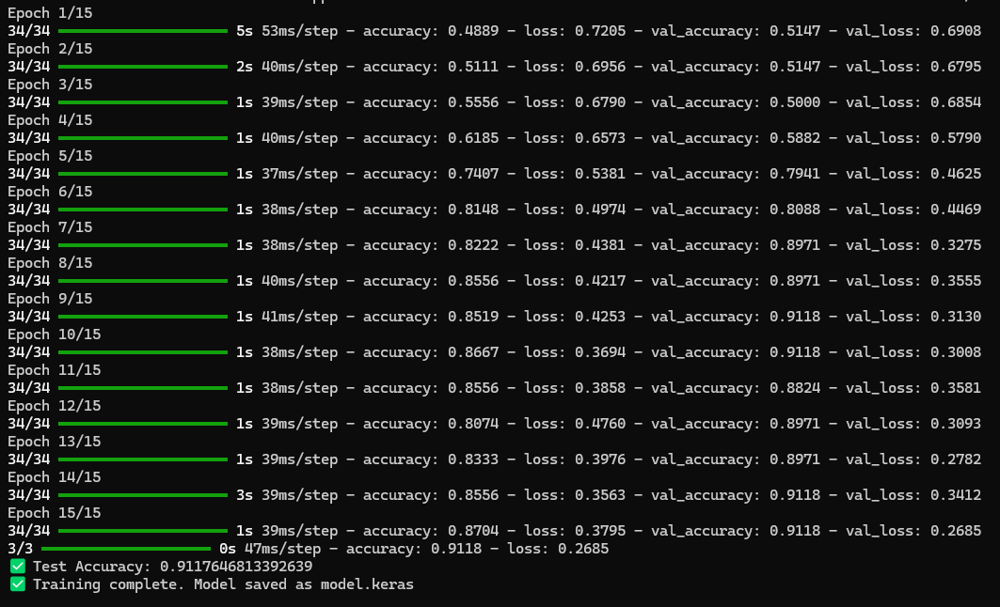
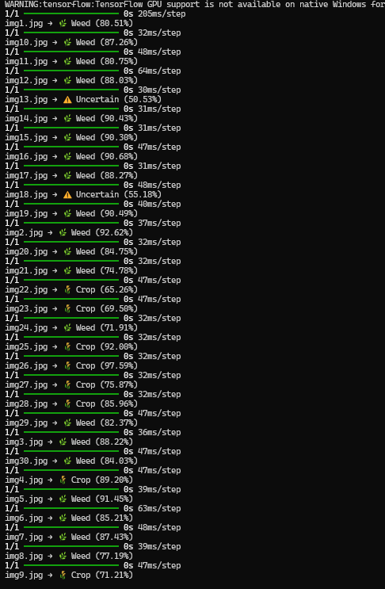

# 🌱 Weed Detection using CNN

## 📌 Overview
This project uses a Convolutional Neural Network (CNN) to classify images as crop or weed.

## 🧠 Working Principle
The model learns patterns such as edges, shapes, and textures from images and uses them to classify inputs.

## ⚙️ Tech Stack
- Python
- TensorFlow
- OpenCV
- NumPy

## 🚀 How to Run
1. Run day4.py to train model
2. Run day5.py to test images

## 📊 Results

### Training

### Prediction

## ⚠️ Limitations
- Small dataset
- Similar-looking crops and weeds may confuse model

## 🚀 Future Work
- Add more data
- Use object detection (YOLO)
- Real-time camera detection
